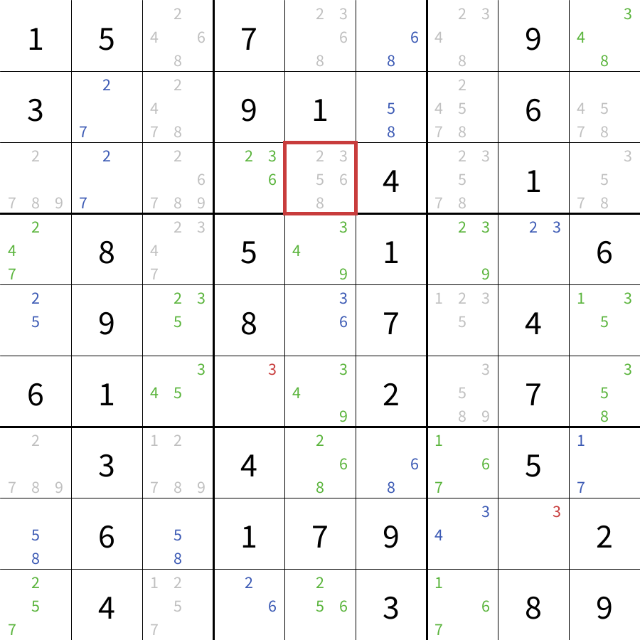

# Sudoku Solver

## About

This is a simple tool to help solve sudokus. I coded it to help me to just that.

This tool is not intended as a complete sudoku solver, but rather as a helper, that does the tedious task.
It does not implement any 'strong' strategies nor does it implement search.

In the future I may come back to this tool to make it more useful.



## Usage

To run this project, you have a couple ways, the first and easiest way is to install the Processing IDE, open it and run it.

If you want a cleaner way, I'd recommend installing **processing-java**. If you do that you can then just do:

```
make
```

## Installation

**I do not recommend to install this project**, but you still have the option.

```
make build
sudo make install
make clean
```

## Licence

This project is licenced under the GPLv3 licence.
For more information, read the license file.
